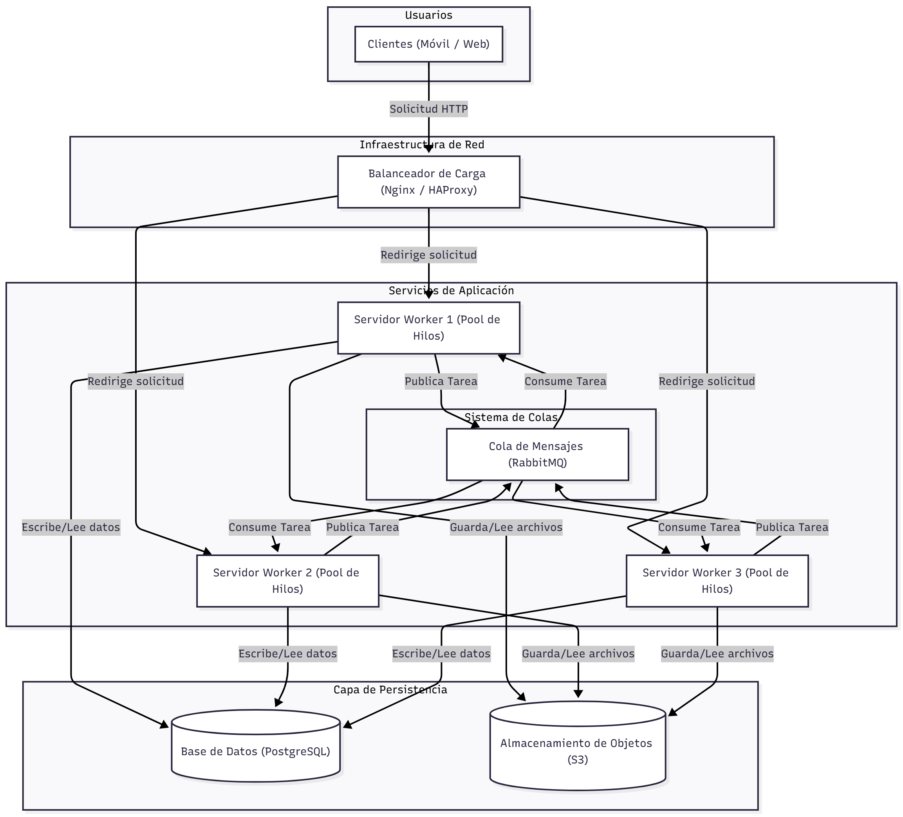
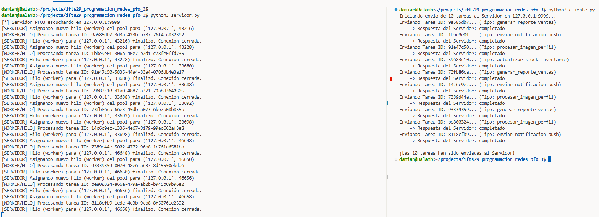

# IFTS 29 - Tecnicatura en Desarrollo de Software
## Programación sobre redes - 3° D

### Práctica Formativa Obligatoria 3
**Sistema de Gestión de Tareas**

**Alumno:** Damián Andrés Clausi  
**Profesor:** Germán Ríos

**Fecha de entrega:** 03/11/2025 

## Consignas:
1. Diseña un diagrama que incluya:
- Clientes (móviles, web).
- Balanceador de carga (Nginx/HAProxy).
- Servidores workers (cada uno con su pool de hilos).
- Cola de mensajes (RabbitMQ) para comunicación entre servidores.
- Almacenamiento distribuido (PostgreSQL, S3).

2. Implementa en Python:
- Un servidor que reciba tareas por socket y las distribuya a workers.
 - Un cliente que envíe tareas y reciba resultados.
 
